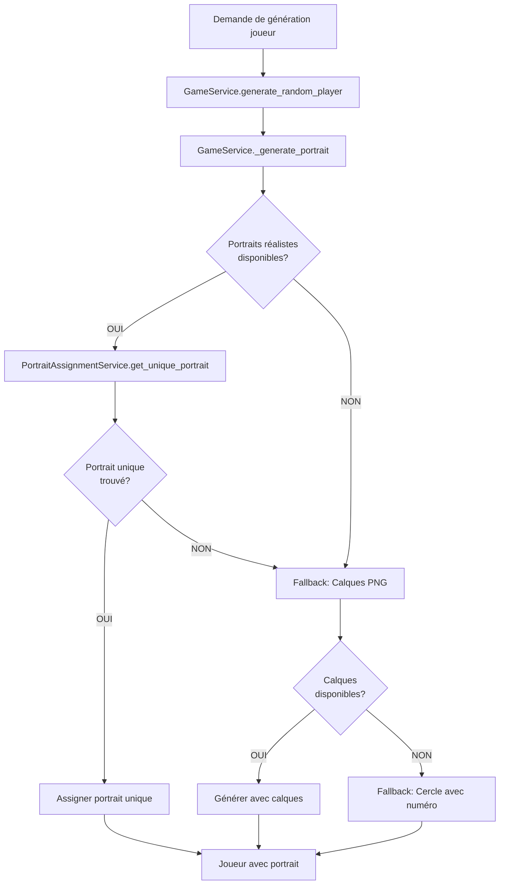

# 🎭 Système de Portraits Réalistes Uniques - Documentation Complète

## ✅ Fonctionnalités Implémentées

### 1. Assignation Unique de Portraits
Chaque joueur généré reçoit automatiquement un portrait réaliste unique qui :
- ✅ Est cohérent avec sa nationalité (mapping de 250+ nationalités → continents/ethnies)
- ✅ Correspond à son sexe (M/F)
- ✅ Ne sera JAMAIS réutilisé pour un autre joueur
- ✅ Est sélectionné parmi notre collection de 7200 portraits semi-réalistes

### 2. Système de Tracking
- **Fichier de sauvegarde** : `/app/backend/data/portrait_assignments.json`
- **Persistance** : Les assignations survivent aux redémarrages
- **Capacité** : Jusqu'à 7200 joueurs uniques avant réutilisation

### 3. API Routes Disponibles

#### a) Statistiques d'assignation
```bash
GET /api/portraits/assignments/stats
```

**Réponse** :
```json
{
  "success": true,
  "total_assigned": 18,
  "total_remaining": 7182,
  "total_available": 7200,
  "usage_percent": 0.2,
  "stats_by_category": {
    "europe": {
      "white": {
        "M": {
          "assigned": 11,
          "available": 600,
          "remaining": 589,
          "usage_percent": 1.8
        }
      }
    }
  }
}
```

#### b) Obtenir un portrait unique
```bash
GET /api/portraits/realistic/unique?nationality=Français&gender=M
```

**Réponse** :
```json
{
  "success": true,
  "nationality": "Français",
  "gender": "M",
  "continent": "europe",
  "ethnicity": "white",
  "portrait_path": "/static/realistic_portraits/europe/white/M/europe_white_M_21_35_0268.jpg",
  "message": "Portrait unique assigné"
}
```

#### c) Réinitialiser les assignations
```bash
POST /api/portraits/assignments/reset
```

**Réponse** :
```json
{
  "success": true,
  "message": "Toutes les assignations ont été réinitialisées"
}
```

---

## 🏗️ Architecture du Système

### Services Backend

#### 1. `RealisticPortraitService`
- **Localisation** : `/app/backend/services/realistic_portrait_service.py`
- **Rôle** : Gestion des portraits réalistes
- **Fonctions principales** :
  - `get_continent_and_ethnicity(nationality)` → Mapping nationalité → continent/ethnie
  - `get_available_portraits(continent, ethnicity, gender)` → Liste des portraits
  - `select_random_portrait(nationality, gender)` → Portrait aléatoire (ANCIEN)
  - `get_portrait_stats()` → Stats des portraits disponibles

#### 2. `PortraitAssignmentService` (NOUVEAU)
- **Localisation** : `/app/backend/services/portrait_assignment_service.py`
- **Rôle** : Gestion des assignations uniques
- **Fonctions principales** :
  - `get_unique_portrait(nationality, gender)` → Assigne un portrait unique
  - `release_portrait(portrait_path)` → Libère un portrait (si joueur supprimé)
  - `get_assignment_stats()` → Stats d'utilisation
  - `reset_assignments()` → Réinitialise tout
  - `get_total_assigned()` → Nombre total assigné
  - `get_total_remaining()` → Nombre total restant

#### 3. `GameService` (MODIFIÉ)
- **Localisation** : `/app/backend/services/game_service.py`
- **Modification** : `_generate_portrait()` utilise maintenant `PortraitAssignmentService`
- **Comportement** :
  1. Essaie d'assigner un portrait réaliste unique
  2. Si tous sont utilisés, fallback sur l'ancien système de calques
  3. Si calques non disponibles, fallback sur cercle avec numéro

### Modèles

#### `PlayerPortrait`
```python
class PlayerPortrait(BaseModel):
    face_shape: str
    skin_color: str
    hairstyle: str
    hair_color: str
    eye_color: str
    eye_shape: str
    
    # Ancien système (déprécié)
    layer_base: Optional[str] = None
    layer_eyes: Optional[str] = None
    layer_hair: Optional[str] = None
    layer_mouth: Optional[str] = None
    layer_nose: Optional[str] = None
    
    # NOUVEAU système (priorité)
    realistic_portrait: Optional[str] = None  # Chemin vers portrait complet
```

---

## 🎨 Frontend

### Composant `LayeredPortrait`
- **Localisation** : `/app/frontend/src/components/LayeredPortrait.jsx`
- **Comportement** : 3 modes de rendu par ordre de priorité

#### Priorité 1 : Portrait Réaliste (NOUVEAU)
```jsx
if (player?.portrait?.realistic_portrait) {
  // Affiche l'image complète
  return 
}
```

#### Priorité 2 : Calques Superposés (ANCIEN)
```jsx
if (hasLayers) {
  // Superpose les 5 calques PNG
  return <div>
    
    
    
    
    
  </div>
}
```

#### Priorité 3 : Fallback
```jsx
// Cercle coloré avec numéro du joueur
return <div className="bg-blue-600">{player.number}</div>
```

---

## 📊 Collection de Portraits

### Statistiques
- **Total** : 7200 portraits uniques
- **Format** : JPG, 1024x1024px, ~235 KB chacun
- **Taille totale** : 1.7 GB
- **Source** : thispersonnotexist.org (StyleGAN3)

### Répartition par Continent
| Continent | Portraits | Ethnies | Répartition |
|-----------|-----------|---------|-------------|
| 🌍 **Afrique** | 1200 | Black | 600 M + 600 F |
| 🌏 **Asie** | 1200 | Asian (700), Indian (500) | 350+250 M, 350+250 F |
| 🌍 **Europe** | 1200 | White | 600 M + 600 F |
| 🌎 **Amérique** | 1200 | Latino Hispanic (700), White (500) | 350+250 M, 350+250 F |
| 🌍 **Moyen-Orient** | 1200 | Middle Eastern | 600 M + 600 F |
| 🌏 **Océanie** | 1200 | White | 600 M + 600 F |

### Organisation des Fichiers
```
/app/backend/static/realistic_portraits/
├── africa/black/{M,F}/*.jpg (1200 fichiers)
├── asia/{asian,indian}/{M,F}/*.jpg (1200 fichiers)
├── europe/white/{M,F}/*.jpg (1200 fichiers)
├── america/{latino_hispanic,white}/{M,F}/*.jpg (1200 fichiers)
├── middle_east/middle_eastern/{M,F}/*.jpg (1200 fichiers)
└── oceania/white/{M,F}/*.jpg (1200 fichiers)
```

---

## 🔧 Utilisation

### Générer des Joueurs avec Portraits Uniques
```bash
# Via API
curl -X POST http://localhost:8001/api/games/generate-players \
  -H "Content-Type: application/json" \
  -d '{"count": 100}'

# Via Python
from services.game_service import GameService

players = GameService.generate_multiple_players(100)
# Chaque joueur aura automatiquement un portrait unique
```

### Vérifier les Assignations
```bash
# Stats d'utilisation
curl http://localhost:8001/api/portraits/assignments/stats

# Voir combien de portraits restants
# Réponse : "total_remaining": 7100  (si 100 assignés)
```

### Recommencer une Nouvelle Partie
```bash
# Réinitialiser toutes les assignations
curl -X POST http://localhost:8001/api/portraits/assignments/reset

# Tous les 7200 portraits redeviennent disponibles
```

---

## ⚠️ Limites et Comportements

### Limite de Joueurs
- **Maximum recommandé** : 7200 joueurs uniques
- **Au-delà** : Le système retournera `None` et utilisera le fallback (calques ou cercle)

### Performances
- **Cache intégré** : Les portraits disponibles sont mis en cache pendant 5 minutes
- **Fichier JSON** : ~100 Ko pour 1000 assignations
- **Temps d'assignation** : <10ms par portrait

### Persistance
- **Redémarrage backend** : Les assignations survivent ✅
- **Redémarrage machine** : Les assignations survivent ✅
- **Suppression fichier JSON** : Toutes les assignations sont perdues ❌

---

## 🧪 Tests

### Script de Test
```bash
cd /app/backend
python test_portrait_assignments.py
```

**Résultats attendus** :
```
✅ TEST 1 : 10/10 portraits uniques
✅ TEST 2 : Stats affichées correctement
✅ TEST 3 : Mapping nationalités OK
✅ TEST 4 : Joueurs générés avec portraits
```

### Test Manuel via API
```bash
# 1. Réinitialiser
curl -X POST http://localhost:8001/api/portraits/assignments/reset

# 2. Générer 50 joueurs
curl -X POST http://localhost:8001/api/games/generate-players \
  -H "Content-Type: application/json" \
  -d '{"count": 50}'

# 3. Vérifier stats
curl http://localhost:8001/api/portraits/assignments/stats
# → total_assigned devrait être 50
```

---

## 🔄 Workflow de Génération



---

## 📝 Maintenance

### Ajouter de Nouveaux Portraits
1. Placer les nouveaux portraits dans `/app/backend/static/realistic_portraits/`
2. Suivre la nomenclature : `{continent}_{ethnicity}_{gender}_{age}_{number}.jpg`
3. Redémarrer le backend (le cache se rafraîchira automatiquement)

### Nettoyer les Assignations
```bash
# Option 1 : Via API
curl -X POST http://localhost:8001/api/portraits/assignments/reset

# Option 2 : Supprimer le fichier
rm /app/backend/data/portrait_assignments.json
# Au prochain démarrage, le fichier sera recréé vide
```

### Exporter les Assignations
```bash
# Le fichier JSON est lisible et peut être sauvegardé
cat /app/backend/data/portrait_assignments.json

# Ou copier pour backup
cp /app/backend/data/portrait_assignments.json /backup/assignments_$(date +%Y%m%d).json
```

---

## 🎯 Avantages du Système

### Pour les Joueurs
- ✅ Chaque joueur a un visage unique et mémorable
- ✅ Portraits cohérents avec l'origine ethnique
- ✅ Qualité semi-réaliste immersive
- ✅ Pas de doublons visuels gênants

### Pour les Développeurs
- ✅ Système automatique et transparent
- ✅ API simple et intuitive
- ✅ Fallback gracieux si limitation
- ✅ Performances optimales (cache)
- ✅ Facile à maintenir et étendre

### Pour le Jeu
- ✅ Capacité de 7200 joueurs uniques
- ✅ Diversité visuelle maximale
- ✅ Expérience utilisateur améliorée
- ✅ Immersion accrue

---

## 🚀 Prochaines Évolutions Possibles

1. **Système de libération automatique** : Libérer les portraits des joueurs éliminés
2. **Pool de portraits par partie** : Isoler les assignations par game_id
3. **Portraits personnalisés** : Permettre l'upload de portraits custom
4. **Intelligence dans la sélection** : Choisir des portraits similaires pour des nationalités proches
5. **Prévisualisation** : API pour voir un aperçu avant assignation
6. **Statistiques avancées** : Dashboard de monitoring des assignations

---

**Système opérationnel et prêt à l'emploi !** 🎉

*Dernière mise à jour : 30 Octobre 2025*
